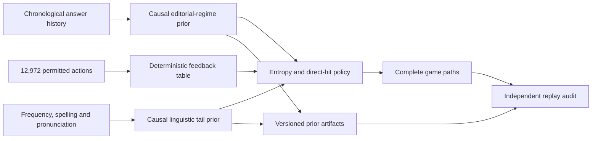

<h1 align="center">
  
  Quintropy
</h1>

<p align="center">
  <strong>A causal Bayesian solver for five-letter word puzzles.</strong>
</p>

<p align="center">
  Model answer selection, search the complete action space and replay every decision from
  versioned research artifacts.
</p>

<p align="center">
  <a href="https://github.com/jorgeflmendes/quintropy/actions/workflows/ci.yml"></a>
  
  
  
</p>

<p align="center">
  <a href="#overview">Overview</a> ·
  <a href="#web-solver">Web solver</a> ·
  <a href="#published-result">Published result</a> ·
  <a href="#architecture">Architecture</a> ·
  <a href="#local-development">Local development</a> ·
  <a href="#quality">Quality</a>
</p>

## Overview

Quintropy separates answer modeling from guess selection. A causal prior estimates which words
are plausible answers using only information available before each puzzle date. The policy then
searches all 12,972 permitted actions using Shannon information gain, direct-hit utility and exact
small-state search where configured.

Experiments are stored with their priors, complete action paths, configuration, dependency
versions and input hashes. The independent auditor reconstructs the policy and verifies every
decision and reported metric.

## Web solver

[Open the static Quintropy solver](https://jorgeflmendes.github.io/quintropy/) to enter the
feedback from a live board and receive the selected model's next recommendation. The interface
loads a frozen causal snapshot, filters candidates with exact duplicate-letter semantics and
searches all 12,972 permitted actions in a Web Worker. Board data remains on the device; the site
has no application server, analytics or external runtime dependencies.

The deployable site lives entirely in [`web/`](./web). Regenerate its model snapshot after an
intentional training-data or selected-model update:

```bash
quintropy export-web --output web/model.json
```

## Published result

The repository contains one immutable evaluation of the selected architecture:

| Period                | Games | Mean tries | Accuracy@6 | Worst case |
| --------------------- | ----: | ---------: | ----------: | ---------: |
| 2026-05-01–2026-08-12 |   104 |      3.077 |        100% |          6 |

The complete, schema-v2 artifact is available under
[`results/baselines/editorial_regime_linguistic_tail_2026-05-01_2026-08-12`](./results/baselines/editorial_regime_linguistic_tail_2026-05-01_2026-08-12).
It binds the corrected 8,926-word answer universe, the chronological history, dependency
versions and the implementation hash. The period was inspected during development, so this is a
reproducible retrospective evaluation, not independent prospective evidence.

## Capabilities

- **Causal prior generation** — fit each daily distribution exclusively from earlier answers.
- **Separate answer and action spaces** — assign probability only to supported answers while
  retaining every permitted word as an informative action.
- **Editorial-regime modeling** — estimate interpretable mass across classic, expanded, unseen
  and repeated-answer regimes.
- **Linguistic tail resolution** — use a separately stored orthographic and pronunciation model
  inside a narrow, explicit late-game confidence band.
- **Information-theoretic policy** — combine feedback entropy, direct-hit utility and optional
  exact Bellman search.
- **Independent experiment replay** — verify hashes, manifests, paths, policy decisions and
  metrics from the published artifacts.

## Architecture



### Answer and action universes

Let `A` be the answer universe and `G` the permitted actions. `G` contains all 12,972 classic
actions. `A` contains the 2,315 classic solutions plus actions with positive English frequency
under `wordfreq==3.1.1`. Priors assign zero mass outside `A`; informative guesses may still use
any action in `G`.

### Causal editorial model

For a puzzle on date `t`, the model may use only history with `date < t`. It assigns
recency-weighted mass to four regimes:

```text
                         classic vocabulary   expanded vocabulary
previously unseen word           C0                    E0
repeated word                    C1                    E1
```

Within each regime, the score combines tempered lexical frequency, positional letters, bigrams,
vowel structure and repeated-letter structure. Generated artifacts bind the configuration,
answer universe, dependency versions, input hashes and generator implementation.

### Linguistic tail model

A logistic density-ratio model captures English orthographic and pronunciation evidence. It is
trained only on historical prefixes and consulted with 3–20 remaining candidates under explicit
editorial and linguistic confidence bounds. It remains a separate artifact and never silently
replaces the primary prior.

Model selection uses four contiguous forward folds rather than shuffled K-fold. Every fold has an
84-game tuning window, a seven-game embargo and a later validation block. All learned transforms
and priors are fitted from chronological prefixes, and validation targets never enter their own
features or distributions.

### Decision policy

The policy scores each action with:

`score(g) = H_bits(feedback | g) + 3 × expanded_factor(g) × p(g)`

where `expanded_factor=1.5` for expanded-vocabulary answers. A concentrated posterior triggers a
direct MAP guess; otherwise the policy evaluates every permitted action. Endgames with at most
three candidates use exact Bellman search over the complete action space.

## Local development

### Requirements

- Python 3.10 or newer
- `pip`

### Setup

```bash
git clone https://github.com/jorgeflmendes/quintropy.git
cd quintropy
python -m venv .venv
# Windows: .venv\Scripts\activate
# POSIX: source .venv/bin/activate
python -m pip install -e ".[dev]"
quintropy --help
```

### Run an experiment

```bash
quintropy evaluate \
  --start 2026-05-01 --end 2026-08-12 \
  --prior-family editorial-regime \
  --expanded-language-override \
  --output results/experiments/local

python benchmarks/audit_experiment.py results/experiments/local
```

Use `generate-priors` followed by `evaluate-priors` to inspect and freeze priors before policy
evaluation. Local experiment output is ignored by Git.

## Quality

```bash
python -m ruff format --check src benchmarks tests
python -m ruff check src benchmarks tests
python benchmarks/verify_wordlists.py
python benchmarks/verify_checksums.py
python benchmarks/audit_experiment.py results/baselines/editorial_regime_linguistic_tail_2026-05-01_2026-08-12
python -m pytest
python -m quintropy export-web --output web/model.json --check
node --test tests/web/*.test.mjs
```

The quality pipeline covers static checks, causal-boundary regression tests, word-list and artifact
integrity, complete policy replay and independent metric recomputation.

## Repository layout

```text
.
├── benchmarks/  Integrity checks and experiment replay
├── data/        Versioned source inputs
├── results/     Selected immutable evaluation
├── src/         Quintropy package
├── tests/       Logic, causal, regression and audit tests
└── web/         Static local-inference solver for GitHub Pages
```

## Data provenance

| Source | Use | Rights note |
| ------ | --- | ----------- |
| [Laurent Lessard's wordlesolver](https://github.com/LaurentLessard/wordlesolver) | Classic answer and action lists | No explicit upstream license was found; confirm redistribution rights |
| [english-word-frequency](https://github.com/ps-kostikov/english-word-frequency) | Local English-frequency data | No explicit upstream license was found; confirm redistribution rights |
| [nyt-wordle-played](https://github.com/johnfoland/nyt-wordle-played) | Append-only chronological history through 2026-08-25 | CC0 1.0 Universal |

## Current limitations

- The published period is retrospective and was inspected during development.
- Editorial behavior may drift beyond the frozen history window.
- Open-world coverage depends on the declared answer universe.
- The bundled third-party word lists require an independent redistribution-rights review.

## Legal and citation

Quintropy is independent of and unaffiliated with The New York Times Company. No project-wide
software license is currently declared. See [NOTICE.md](./NOTICE.md) and
[CITATION.cff](./CITATION.cff) for legal and citation metadata.
